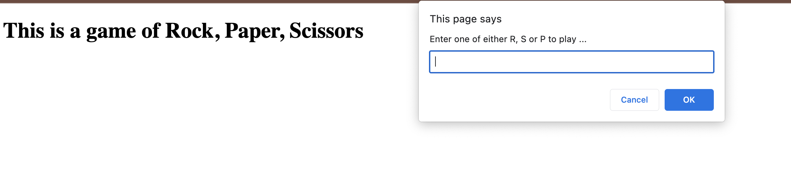

# rockpaperscissors

## The Purpose of this program is that you can play a nice game of Rock, Paper, and Scissors with the computer.

## As a developer of this program, here is pseudo as to how it was to be worked out

- Create a couple of variables to 
    - store the user input
    - store wins, losses and ties

- The computer will generate a random characters from the list of characters (rps).
- The computer's character should be compared to the users character.
    - if the user has a winning hand, then mark the winslosstie variable as having a win, same with loss, and same with tie.
- The user can be asked again if they want to play, quit if not.

## How the game is played. 

The first thing that will happens when you go to the site is that it presents you with a statement that you are about to play a game and you are presented with a window to make a choice for this game.

Now you make a choice in the game and type in one of 3 characters: R, P, or S in order to start the game. If you don't make one of those choices, then it will tell you to make a different choice.

Once you make it, the computer will make its own rando choice and let you know if you win or lose.

After you click ok on this, it will then give you stats and you can continue playing by selecting ok until you select cancel and the game ends.

## Thoughts on this project

This was a fun little project and helped me to get to under stand the use of functions and how versitile they are. There is also math.random, which was new and then putting in some decision making and presentation of the items so the user can get feedback in a clear way.

## Where to find this code and website
| Links to Code        | Resource URL           |
| ------------- |:-------------:|
| RockPaperScissor site    | [https://flimits.github.io/rockpaperscissors/](https://flimits.github.io/rockpaperscissors/) |
| GitHub Repo | [https://github.com/flimits/my-portfolio](https://github.com/flimits/rockpaperscissors)     |

## Some Technologies Relyed upon to complete this task
| Technology Used         | Resource URL           |
| ------------- |:-------------:|
| CSS W3School for functions    | [https://www.w3schools.com/css](https://www.w3schools.com/css)      |
| Mozilla Web docs for functions | [https://developer.mozilla.org/](https://developer.mozilla.org/en-US/docs/Web/JavaScript/Reference/Global_Objects/Math/floor)
| GitHub | [https://github.com/](https://github.com/)     |

